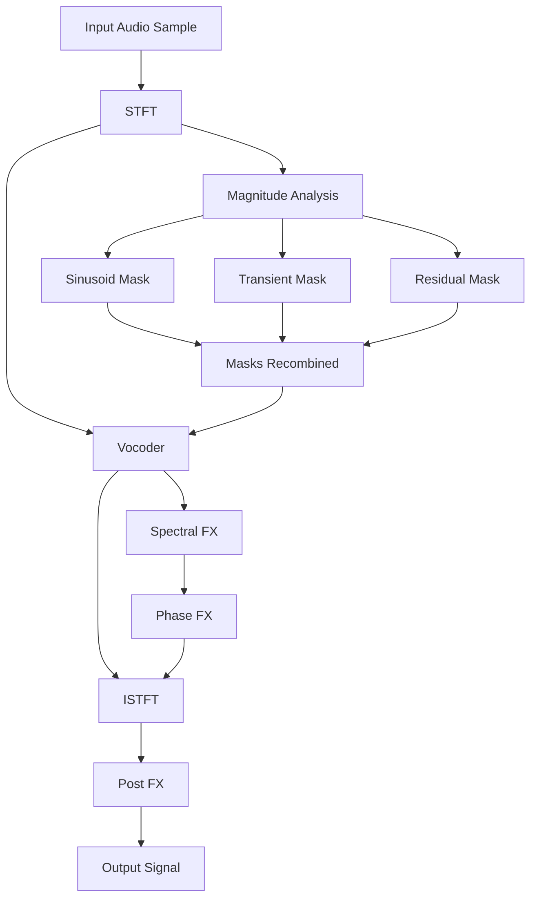

# **The Sound-0-Matic mk1 Technical Design Document**

---

### 🚧 **(Work in Progress)** 🚧

---

## Table of Contents

 ...tbd

---

## Introduction

The **Sound-0-Matic mk1** is a monophonic, performance-oriented spectral sampler synthesizer developed by nonlinear laboratories. In the Sound-0-Matic, incoming audio is analyzed via a Short-Time Fourier Transform (STFT) and split into sinusoidal (tonal), transient (attack), and noise (residual) components. Then, phase-vocoder methods and spectral modeling provide the theoretical foundation: for instance, FFT-based vocoders enabled speech coding and musical time/pitch modification as early as the 1970s.  The Sound-0-Matic builds on these insights but targets live performance: low latency processing is critical.  The core analysis and resynthesis engine is implemented in highly optimized C++ (using FFT libraries like FFTW or KISS) within the JUCE framework.  The plugin optionally embeds Faust-generated DSP code for some filters or effects modules.  The user interface is styled with a retro analog aesthetic (knobs, switches, VU meters) while providing modern conveniences like MIDI-learnable parameters and real-time waveform/spectrum displays.

In summary, the Sound-0-Matic offers a research-grade (but performer ready) spectral sampler synthesizer that can freeze sounds, blur and smear spectra, apply creative phase-domain transformations, and otherwise reshape sound in musically useful ways.  Its intended users are DSP-savvy audio programmers, plugin developers, and experimental sound designers who appreciate detailed control over spectral content.

### Open Source Philosophy & Licensing Strategy

The Sound-0-Matic is committed to remaining 100% open source throughout its lifecycle. All code, documentation, and associated materials will be released under GPLv3 or compatible licenses.

- **Core Plugin**: GPLv3 (ensures derivative works remain open)
- **Dependencies**: Only GPL-compatible libraries (JUCE Personal/GPL, FFTW3, KissFFT)
- **Documentation**: Creative Commons BY-SA 4.0
- **Build System**: MIT-licensed CMake scripts where possible
- **NO PROPRIETARY DEPENDENCIES**: Reject any closed-source libraries, even if performance benefits exist

### Project Scope

This document details the technical design of the Sound-O-Matic plugin, broken into logical components.  The project scope includes:

* **Spectral Analysis Engine:** Implement a low-latency STFT pipeline (windowing + FFT) with adjustable frame size, hop size, and overlap-add processing.  Use COLA-compliant windows (e.g. Hamming) for perfect reconstruction.  Provide options for zero-padding to allow fine-grained spectral manipulation.

* **STN Decomposition**: Implement spectrogram-based morphological filtering using mathematical morphology operations. This approach analyzes the 2D time-frequency representation to separate:
  - **Harmonic Structures**: Detected via morphological opening with vertical structural elements
  - **Transient Events**: Extracted using top-hat transforms to highlight brief spectral peaks
  - **Residual Components**: Modeled through morphological closing operations
  
  This method provides more robust separation of spectral components compared to traditional sinusoidal modeling, especially for complex polyphonic material.

* **Phase Vocoder (Pitch Shifter)**: Implement a phase vocoder for pitch shifting and time stretching.  Use a phase vocoder to modify the phase of the STFT bins to achieve time-varying pitch shifts.  This allows for smooth and continuous pitch modifications without introducing artifacts.
  - Accepts a user-defined root note to determine the sample's base pitch
  - Calculates pitch ratio from incoming MIDI note and root note
  - Reads MIDI pitch, applies time-stretching and pitch-shifting via phase delta scaling
  - Operates on phase array in mono before other phase FX
  - Phase unwrapping to avoid phase discontinuities
  
* **Real-Time Spectral Effects:** Provide controls for effects such as *Freeze* (hold or loop the current spectrum), *Blur* (smooth or diffuse spectral peaks), *Smear* (time-domain convolution carried out in the spectral domain), and *Phase Swap* (manipulate phase of spectral bins for chorusing or stereo effects).  Implement pitch shifting and time-stretching via a phase-vocoder (phase unwrapping and increment scaling) for creative pitch/font adjustments with MIDI control.  Ensure each effect is computed on-the-fly with minimal latency. 

* **Stereo and Spatial Processing:** Support stereo input.  Include special stereo phase-processing features (e.g. inter-channel phase shifting, mid/side spectral effects) to create stereo textures.  Ensure phase relationships can be independently adjusted per channel for spatial modulation.

* **User Interface & MIDI:** Design a retro-analog GUI (knobs, sliders, toggle switches, vintage fonts) grouped by function (analysis, effects, envelopes, mixing).  Include visual feedback: waveform and/or spectrum display, dB meter, peak indicator.  All major parameters (e.g. effect mix levels, window size, pitch ratio) will support MIDI CC learn and host automation.

* **Performance Goals:** The audio callback must run in real time with typical buffer sizes (64–256 samples) and incur very low latency (on the order of 5–10ms or less).  CPU utilization should allow multiple instances on a modern CPU.  This requires highly optimized FFT code, efficient memory handling (no dynamic allocation or locks in the audio thread), and parameter smoothing (to avoid zipper noise) using cheap one-pole filters or JUCE’s dsp::SmoothedValue.

* **Modular Architecture:** Structure the code so DSP modules (FFT, peak tracker, filters, etc.) are encapsulated.  Use Faust to prototype individual DSP blocks; Faust’s C++ output (via `faust2api`) provides callable DSP classes.  The JUCE plugin audio processor will integrate these blocks into a coherent signal flow.

* **Quality Assurance:** Develop a comprehensive test plan.  Unit test DSP components (FFT invertibility, filter responses, partial trackers) with known signals (sinusoids, impulses, noise).  Profile performance under different CPU loads.  Plan for listening tests to validate sonic quality.  Use version control and continuous integration to ensure reliability.

* **Deployment:** Target Linux (LV2/VST3) with buildable CMake/Ninja project.  Use modern C++ (C++17 or later) and JUCE 6+.  Keep dependencies minimal (JUCE, FFT library, optionally Faust runtime).

Each of these goals will be expanded in the following sections: architecture overview, detailed DSP theory, requirements/priorities, implementation specifics, UI design, testing strategy, and future enhancements.

---

## System Architecture Overview

### JUCE, Faust, and C++ Integration

The sound0matic is built as a standard JUCE audio plugin (e.g. VST3) in C++.  The JUCE **AudioProcessor** class implements the real-time audio callback.  Faust (if used) provides DSP blocks: Faust “.dsp” source files are compiled into C++ using `faust2api`. For example, running:

```
faust myEffects.dsp -o myEffects.cpp
```

produces a C++ class implementing an audio callback.  More conveniently, `faust2api -juce myEffects.dsp` generates a JUCE-compatible DSP engine (e.g. `DspFaust.cpp`/`.h`) that can be dropped into the JUCE project.  In either case, the Faust code defines DSP computations (filters, envelopes, simple effects), while the JUCE processor instantiates these objects and calls their process functions on each audio block.  The AudioProcessorEditor handles the GUI; parameter changes (from knobs or automation) are sent to the DSP via JUCE’s parameter system or direct setter calls (Faust exposes parameter paths).

Internally, the JUCE processor will hold member instances for each DSP component: FFT buffers, window function, a “sine bank” object for partial synthesis, and any Faust DSP classes.  The audio callback (`processBlock`) reads from an input circular buffer, processes through the STFT pipeline, and writes to the output buffer.  Custom C++ classes handle STN separation, transient detection, and effect algorithms.  Faust-generated classes are used for embarrassingly parallel or sample-based tasks (e.g. a one-pole filter, LFO, simple waveshaper) which Faust can express concisely.

### Threading Model, Memory, and Real-Time Safety

JUCE distinguishes the real-time audio thread (processing audio) from the GUI thread.  The AudioProcessor’s `processBlock()` runs in the audio thread and must be non-blocking.  All heavy DSP (windowing, FFT, ISTFT, STN analysis, etc.) occurs here.  No heap allocations, locks, or I/O are allowed on this thread.  Memory (arrays for window coefficients, FFT workspace, circular ring buffers) is pre-allocated in initialization, avoiding any `new` or `malloc` during processing.  For example, use `std::vector<float>` or raw arrays sized to fixed maximum block size (e.g. 4096 samples) for audio buffers.  The FFT plan (if using FFTW, etc.) can be created ahead of time (FFT “wisdom” loaded) to avoid on-the-fly planning overhead.

Parameter updates (knob moves, automation) are usually delivered via JUCE’s `AudioProcessorValueTreeState` or similar.  These updates may arrive asynchronously in the GUI thread or via the host’s automation callback.  To propagate them safely, we either use atomic variables/lock-free FIFOs or simply read the current parameter values at the start of each audio block (JUCE handles synchronization).  Parameter smoothing (e.g. to avoid clicks when changing parameters) is done with simple one-pole filters or JUCE’s `SmoothedValue`, which are real-time safe and do not block.

Special care is taken in the overlap-add mechanism: an output double-buffer of length *N + R* samples holds the IFFT results.  Each processed frame is written into this buffer at the frame’s time offset.  After writing, the first *R* samples are added into the audio output.  Index arithmetic is carefully handled to avoid costly modulus operations (using circular buffer pointers).  No semaphores or waiting is ever used in the audio path.

Faust DSP objects are thread-safe by design (they only do float operations).  We call a Faust `instance->compute(numSamples, inputs, outputs)` each block.  If multiple Faust instances are used, they can be updated from the audio thread as well.  The Faust parameters are updated via `setParamValue(path, value)`, which typically acquires an internal lock; however, updating parameters outside the audio thread or batching updates per block avoids audio glitches.

### Signal Flow (ASCII Diagram)

// work in progress...




* The **FFT Analysis Window** block slides a window (size *M*, hop *R*) over the input, zero-pads to *N*, and computes an *N*-point FFT.
* The spectrum `X_m[k]` is then split into components: sinusoidal peaks (fed into the Sinusoidal Extraction branch), the transient indicator path (to decide if a transient override is needed), and residual noise (fed into the Noise Filter bank).
* Each branch can apply its own processing (e.g. pitch-shifting to sines, bypass or shorter-window to transients, filtering to noise).
* The outputs of all branches are combined spectrally into `Y_m[k]`, then an inverse FFT and overlap-add reconstruct the time-domain output.

This modular flow ensures clarity: for example, turning off the freeze effect is simply “pass-through” in the spectral domain.  The asynchronous GUI thread visualizes the **Audio In** waveform and the **Audio Out** waveform (or spectrogram) by reading from a thread-safe FIFO that mirrors the audio buffer.


## DETAILED DSP THEORY & ALGORITHMS

### FFT, STFT, and IFFT (with COLA, overlap-add, zero-padding)

The core spectral processing is built on the Short-Time Fourier Transform (STFT) and inverse STFT.  In practice, the audio stream is split into overlapping frames of length *M* samples.  Each frame is multiplied by a window function *w\[n]* of length *M*.  We choose a window with the **Constant OverLap-Add (COLA)** property; such as Hamming window with 50% overlap - The Hamming window (α=0.54, β=0.46) provides excellent COLA properties with 50% overlap and superior side-lobe suppression compared to rectangular windows.

In implementation:

* **Windowing:** For frame index *m*, form a zero-phase (symmetric) windowed buffer `x_m[n] = x[n + mR] * w[n]`, `n=0..M-1`.
* **Zero-padding:** Extend `x_m[n]` with zeros to length *N* (`N >= M`, typically a power of 2).  Zero-padding factor `N/M` interpolates the frequency resolution (each FFT bin is split into `N/M` bins).
* **FFT:** Compute the *N*-point FFT: `X_m[k] = sum_{n=0..N-1} x_m[n] * exp(-j 2π k n / N)`.  (When the nonzero data is centered in the buffer, this implements a time-normalized STFT centered at `mR`.)
* **Processing (optional):** Apply any desired modifications to the spectrum `X_m[k]` (filtering, scaling, phase shifts, etc).
* **IFFT:** Compute the inverse FFT to get a real buffer of length *N*.  Because the input was real, one typically only needs to store *N/2+1* bins and use a real IFFT.
* **Overlap-Add:** Write the first *M* samples of the IFFT output back into an output buffer at offset `mR`.  Continue for each frame; overlapping samples are summed.  By the COLA property, the sum of the windowed outputs reconstructs the original signal when no modifications are applied.

The above is the **overlap-add** (OLA) method of STFT synthesis.  An alternative is **overlap-save** (OLS), which performs circular convolution and discards wrap-around; either approach yields identical results under appropriate conditions.

**Important:** The output buffer must handle wraparound.  In practice we use a ring (circular) buffer of length *N+R*.  After writing each IFFT frame at offset `mR`, we add (overlap) it into the buffer.  Then we copy out the first *R* samples as the output and advance the read pointer by *R*.  This is an efficient rolling IFFT.  No re-windowing is needed on overlap-add since the inverse FFT inherently undoes the windowing (given a COLA window).

Pseudocode for the core STFT loop:

```
for each frame m:
  // Analysis
  frame = inputBuffer.read(m*R, M)         // length M
  for n in 0..M-1:
      windowed[n] = frame[n] * w[n]
  padded = zeroPad(windowed, N)           // length N
  X = FFT(padded)                         // complex spectrum length N

  // (perform STN analysis, effects, etc on X)

  // Synthesis
  Y = IFFT(X)                             // real output length N
  outputBuffer.addSamples(m*R, Y[0..N-1])
```

If `X` is unmodified, `addSamples` with a COLA window will yield exact reconstruction.  For large *N*, this incurs latency of `(N/2)/Fs` seconds (half the IFFT window, assuming zero-phase), but provides finer frequency resolution.  Choice of *M*, *R*, and *N* is a trade-off (longer windows give better freq. precision but more latency and smearing in time).

### STN Decomposition via Morphological Filtering for Spectrogram Shape Analysis

The plugin implements a sinusoidal–transient–noise (STN) model on top of the STFT. Since JUCE itself doesn't have a built-in image processing library for advanced morphological operations, we treat the spectrogram as a 2D image and use a dedicated C++ image processing library. So heres my general thought on the workflow:

1. Generate Spectrogram:
     * Compute the STFT of the audio signal.
     * Take the magnitude of the STFT (often in dB scale for better visual/perceptual representation). This 2D array (time x frequency bins) is the "image."
2. Use CImg as a C++ Image Processing Library:
     * CImg Library: A lightweight, header-only C++ image processing library, and its open-source.
          - Pros: Single header file, no complex dependencies, very easy to integrate into a JUCE project (just include CImg.h).
          - Cons: Might not be as optimized as OpenCV for very large images, potentially fewer advanced features (though it covers basics and morphology well).
          - Relevant CImg Functions: img.erode(), img.dilate(), img.get_normalize(), img.get_threshold().
3. Perform Morphological Operations:
     * Data Conversion: the spectrogram data (e.g., juce::AudioBuffer or a custom 2D array of floats) needs to be converted into the image format expected by the chosen library (e.g. cimg_library::CImg<float> for CImg). Remember the dimensions: time usually along the x-axis, frequency along the y-axis. The pixel value will be the magnitude/energy at that time-frequency point.
     * Structuring Elements:
          - For sinusoid extraction (horizontal features): Use a CImg equivalent that is wide and short (e.g., (1, 5) or (1, 10) representing 1 time bin, 5-10 frequency bins).
          - For transient extraction (vertical features): Use a structuring element that is tall and thin (e.g., (5, 1) or (10, 1) representing 5-10 time bins, 1 frequency bin).
          - We can also use more complex shapes.
     * Operations:
          - To extract Sinusoidal components: Apply Opening with a horizontal structuring element. This will remove anything that isn't long and horizontal.
          - To extract Transient components: Apply Opening with a vertical structuring element. This will remove anything that isn't tall and vertical.
          - To extract Noise/Residual: Subtract the (S+T) result from the original spectrogram. We should also consider applying Closing with a small, isotropic (square) structuring element to the noise component to smooth it out before resynthesis.
     * Binary vs. Grayscale: We can apply morphological operations to either a binary spectrogram (after thresholding) or directly to a grayscale (magnitude) spectrogram. Grayscale morphology is often preferred for more nuanced results.
4. Convert Back & Resynthesize:
     * Convert the processed image data back into your internal STFT magnitude format.
     * Combine with the original phase information (if you used magnitude-only processing, which is common for morphology).

Pseudocode (Conceptual C++ for JUCE):

```
#include <juce_audio_processors/juce_audio_processors.h>
// Depending on choice:
// #include <opencv2/opencv.hpp> 
// #include "CImg.h" // If using CImg, download CImg.h and put in project

class SpectrogramMorphologyProcessor
{
public:
    // ... constructor, destructor ...

    void prepare(double sampleRate, int maximumFFTSize)
    {
        // Setup FFT (JUCE's dsp::FFT)
        // Setup windowing (e.g., dsp::Windowing::hamming)
        // Allocate buffers for STFT magnitudes and phases
    }

    void process(const float* inputData, int numSamples)
    {
        // 1. Accumulate audio into FFT buffers and perform STFT
        //    (You'll need a circular buffer and a way to manage FFT blocks)
        
        // Example: For each complete FFT block:
        //    float* fftBuffer = ...; // Get FFT data for current block
        //    fftEngine.performRealOnlyForwardTransform(fftBuffer);
        
        // 2. Extract Spectrogram Magnitude (and keep phase)
        //    float** spectrogramMagnitudeData; // 2D array: time_frames x freq_bins
        //    float** spectrogramPhaseData;     // Store original phase
        //    Convert complex FFT output to magnitude/phase
        //    Take log/dB scale for magnitude for better morphology results
        
        // --- Morphological Operations ---
        
        // Option A: Using OpenCV (requires linking OpenCV)
        // cv::Mat spectrogramMat(num_time_frames, num_freq_bins, CV_32F, spectrogramMagnitudeData[0]); // Create OpenCV Mat from your data
        // cv::Mat sinusoidalComponent, transientComponent, noiseComponent;
        
        // Define structuring elements
        // cv::Mat horizontalKernel = cv::getStructuringElement(cv::MORPH_RECT, cv::Size(kernel_width, 1));
        // cv::Mat verticalKernel   = cv::getStructuringElement(cv::MORPH_RECT, cv::Size(1, kernel_height));
        
        // Extract Sinusoidal (Opening with horizontal kernel)
        // cv::morphologyEx(spectrogramMat, sinusoidalComponent, cv::MORPH_OPEN, horizontalKernel);
        
        // Extract Transient (Opening with vertical kernel)
        // cv::morphologyEx(spectrogramMat, transientComponent, cv::MORPH_OPEN, verticalKernel);
        
        // Extract Noise (as residual)
        // cv::subtract(spectrogramMat, sinusoidalComponent + transientComponent, noiseComponent);
        
        // Option B: Using CImg (simpler integration)
        // CImg<float> spectrogramCImg(num_time_frames, num_freq_bins, 1, 1);
        // Copy spectrogramMagnitudeData to spectrogramCImg
        
        // CImg<float> sinusoidalCImg = spectrogramCImg.get_dilate(horizontal_kernel_width, 1).get_erode(horizontal_kernel_width, 1); // Opening
        // CImg<float> transientCImg = spectrogramCImg.get_dilate(1, vertical_kernel_height).get_erode(1, vertical_kernel_height); // Opening
        
        // CImg<float> noiseCImg = spectrogramCImg - (sinusoidalCImg + transientCImg);
        
        // --- End Morphological Operations ---

        // 3. Convert separated component magnitudes back to your STFT magnitude format
        //    (e.g., from cv::Mat or CImg back to your float** or std::vector<float>)
        
        // 4. Resynthesis:
        //    Reconstruct STFT frames for each component using their processed magnitudes and original phases.
        //    Perform inverse FFT for each component.
        //    Sum components in time domain with overlap-add.
    }

    // ... other DSP functions
};
```

This approach is powerful because it leverages the "image" nature of the spectrogram to perform sophisticated spatial filtering, allowing for a more robust separation of components based on their visual characteristics. Since real-time isn't a strict requirement, we can afford the potentially higher computational cost compared to simpler real-time methods.

### Phase Vocoder Mechanics (Phase Delta, Unwrapping, Pitch/Time Mapping)

## Phase Vocoder Mechanics (Phase Delta, Unwrapping, Pitch/Time Mapping)

Classic phase-vocoder time-stretching and pitch-shifting are used to manipulate playback timing and pitch.  Using the tracked sinusoids (with amplitude A and phase Φ), the instantaneous frequency ω can be computed.  Concretely, between frame *m-1* and *m*, the true phase advance is:

```
ΔΦ = PrincipalArg(Φ_m - Φ_{m-1} - 2π*k*R/N)
ω_inst = (2π*k/N + ΔΦ/R)           (radians per sample)
```

Here `PrincipalArg()` unwraps the phase into the range \[-π,π].  We then synthesize new phases for an output hop *R'*.  For a time-stretch factor *α* = \*R'/*R*, we do:

```
Φ'_m = Φ'_{m-1} + ω_inst * R'
Y_m[k] = A_m * exp(j Φ'_m)
```

Thus if *R'>R* (stretch), phase increments slower, yielding a longer sound.  If *R'\<R*, the sound is compressed.  For pitch shift without time-stretch, one can set *R'=R* but remap frequencies by resampling the spectral envelope (shifting magnitudes to new bins and computing corresponding phases).  In all cases, proper handling of phase wrapping is essential to avoid “phasiness”.

**Pseudocode (for each bin k):**

```
phi = angle(X_m[k])
prev = prevPhase[k]
delta = phi - prev - (2π*k*R/N)
delta = wrapToPi(delta)                 # principal value
omega = (2π*k/N + delta/R)
storedPhase[k] = phi

phi_synth[k] += omega * R_synth
Y_m[k] = mag(X_m[k]) * exp(j * phi_synth[k])
```

The plugin performs this for each spectral bin (or at least for each sinusoidal peak).  Using an FFT vocoder (with unwrapped phase) allows smooth interpolation and exact reconstruction.

### Time-Stretching

$$
\phi_{m,k} = \phi_{m-1,k} + \Delta\phi_{m,k}
$$

$$
\Delta\phi_{m,k} = \omega_k T_a + \text{principal}(\phi_{m,k} - \phi_{m-1,k} - \omega_k T_s)
$$

### Pitch-Shifting (via resampling post-stretch)

$$
X'(\omega) = X(\omega / \alpha)
$$

```mermaid
graph TD
    Frame1 -->|\phi_{m,k}| Phase[Phase Derivative]
    Phase --> Interp[Phase Interpolation]
    Interp --> iFFT[ISTFT]
    iFFT --> Output[Stretched or Shifted Signal]
```

### Optional: Cepstrum and LPC

**Real Cepstrum:**

$$
\hat{x}(n) = \mathcal{F}^{-1} [\log(|X(\omega)|)]
$$

**LPC (Linear Predictive Coding):**

Prediction:
$$
\hat{x}[n] = -\sum_{k=1}^{p} a_k x[n-k]
$$


